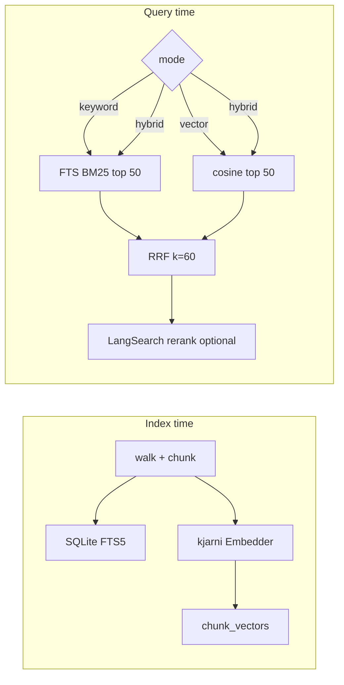

# Handoff: phase3-hybrid-local

**Status:** done  
**Created:** 2026-07-12  
**Specifier:** spec complete  
**Developer:** complete

## GitHub tracking

| Field | Value |
|-------|-------|
| Feature id | `phase3-hybrid-local` |
| Parent issue | — (create via `create-feature-issues.sh` when wired) |
| Open tasks | — |

Task order: `audit` → `spec` → `engine` → `verify` → `docs`

## Intent

Enable **vector** and **hybrid** search over the existing SQLite-backed local index by storing in-process embeddings at index time, fusing BM25 and vector rankings with RRF, and optionally reranking fused candidates via LangSearch—so natural-language queries recall paraphrased content that keyword-only search misses.

## Context (phase 2 baseline)

Phase 2 ships:

- SQLite FTS5 table `chunks_fts` with ~3 KB paragraph-aware chunks
- Incremental indexing by `mtime` + `size` in `files` table
- `search_local` with `mode=keyword` only; `vector` / `hybrid` return a phase-3 error
- Config already exposes `SEARCHIFY_EMBED_MODEL` (default `minilm-l6-v2`)

**Do not replace** the SQLite lexical index with kjarni's native on-disk index format. Extend the existing schema so incremental updates, path allowlist, and chunk metadata stay unified.

## Technical contract

| Area | Requirement |
|------|-------------|
| **Embedding engine** | [`kjarni-go`](https://github.com/olafurjohannsson/kjarni-go) `NewEmbedder(cfg.EmbedModel)` for chunk + query vectors. Lazy-init embedder on first use; `Close()` on service shutdown. |
| **Vector storage** | Schema migration **v1 → v2**: new table `chunk_vectors(chunk_id TEXT PRIMARY KEY, embedding BLOB NOT NULL)` keyed to `chunks_fts.id`. Store float32 little-endian vectors. Record `embed_model` in `meta`. |
| **Indexing** | On each indexed/updated file: embed every chunk after FTS insert; delete vectors for removed chunks. Skipped files (unchanged mtime/size) do **not** re-embed. `--force` re-embeds. Changing `SEARCHIFY_EMBED_MODEL` requires re-index (`--force`) to backfill. |
| **search_local modes** | `keyword` — existing FTS BM25 path (unchanged behavior). `vector` — embed query, cosine similarity vs stored chunk vectors, top `limit`. `hybrid` — run keyword + vector in parallel, each fetch top **50** candidates (`candidatePool`), fuse with **RRF k=60**, return top `limit`. |
| **Default mode** | When `mode` omitted: `hybrid` if index has ≥1 vector row; else `keyword` (backward compatible on pre-migration indexes). |
| **RRF** | Implement in `internal/rank/rrf.go`. Input: ranked lists of chunk IDs + scores per leg. Output: fused list sorted by RRF score. Unit-test with fixed rank inputs. |
| **Optional rerank** | New input `rerank` (bool, default `false`). When `true`: call LangSearch semantic rerank API on fused candidates (≤50 docs). Requires `LANGSEARCH_API_KEY`; if missing, return clear tool error (do not silently skip). Respect free-tier limits; no persistent cache required in v1 (defer to phase 4 web client). |
| **MCP tool changes** | `search_local`: add `rerank`, extend `mode` jsonschema; remove phase-3 rejection for `vector`/`hybrid`. `index_status`: add `embed_model`, `vector_chunk_count`, `vector_ready` (true when vector count equals chunk count). |
| **CLI** | No new subcommand required; existing `searchify index [--force]` triggers embedding. Optional: log embed progress on stderr when indexing many files. |
| **Server version** | Bump MCP server version to **0.3.0**. |
| **Performance** | `search_local` hybrid (no rerank): **<300 ms** on ~50k chunks (dev machine). Vector-only brute-force cosine is acceptable for v1; document if slower. Indexing throughput may drop due to embedding; acceptable for v1. |
| **Acceptance** | (1) After `index_paths`, `index_status.vector_ready=true`. (2) Fixture doc indexed with term `shard_id` but no word "partition"; query `"how are realms partitioned"` returns the doc in **hybrid** or **vector** mode. (3) Same query in **keyword** mode may miss (OK). (4) `go test ./...` passes. (5) `rerank=true` without API key returns actionable error. |

## Architecture



## Touchpoints

| Package / file | Change |
|----------------|--------|
| [`internal/local/service.go`](internal/local/service.go) | Schema v2 migration; embedder lifecycle; wire vector upsert/delete |
| [`internal/local/indexer.go`](internal/local/indexer.go) | Call embed path after `indexFile` |
| [`internal/local/searcher.go`](internal/local/searcher.go) | `SearchKeyword`, `SearchVector`, `SearchHybrid`; refactor existing `Search` |
| **new** `internal/local/embedder.go` | kjarni embedder wrapper (embed text → []float32) |
| **new** `internal/local/vector.go` | Store/load vectors; brute-force top-k cosine |
| [`internal/rank/rrf.go`](internal/rank/rrf.go) | RRF fusion |
| **new** `internal/rank/rerank.go` | LangSearch rerank HTTP client (minimal; share patterns with future `internal/web`) |
| [`internal/mcp/tools_search_local.go`](internal/mcp/tools_search_local.go) | Modes + rerank input |
| [`internal/mcp/tools_index_status.go`](internal/mcp/tools_index_status.go) | Vector readiness fields |
| [`internal/search/types.go`](internal/search/types.go) | Extend `IndexStatus` if needed |
| [`internal/local/local_test.go`](internal/local/local_test.go) | Hybrid/vector acceptance test |
| **new** `internal/rank/rrf_test.go` | RRF unit tests |
| [`docs/architecture.md`](docs/architecture.md) | Storage section: vectors in SQLite |
| [`README.md`](README.md) | Phase 3 status, mode docs |
| [`docs/feature-backlog.md`](docs/feature-backlog.md) | Mark 🟡 when implementing; ✅ when done via `record-feature-complete.sh` |

## API surface (search_local)

```json
{
  "query": "how are realms partitioned",
  "mode": "hybrid",
  "limit": 10,
  "rerank": false
}
```

Response unchanged shape: `{ count, results[] }` with `search.Result` entries; fused/reranked scores replace per-leg BM25 scores.

## Schema migration notes

- Bump `schemaVersion` from `1` to `2`.
- On upgrade: create `chunk_vectors`; set `meta.embed_model` from config.
- Existing FTS rows remain searchable via `keyword` immediately.
- `vector_ready=false` until user runs `index_paths --force` (or re-touches files) to populate embeddings.
- Document this in README under "Upgrading from phase 2".

## Out of scope

- Hybrid search in `search_file` (still keyword-only)
- kjarni native indexer/searcher disk format (no dual index)
- HNSW / approximate nearest neighbor (add only if brute-force fails perf target on realistic corpora)
- LangSearch web search (`search_web` — phase 4)
- Rerank response caching, quota dashboards (phase 4/5)
- HTTP transport changes
- Automatic query-mode router (`internal/search/router.go`) — explicit `mode` only for v1; default hybrid is sufficient

## Risks and mitigations

| Risk | Mitigation |
|------|------------|
| kjarni-go model download size / first-run latency | Document; lazy-load embedder; log once on stderr |
| Re-index required after migration | Clear `index_status.message` when `vector_ready=false` |
| Brute-force vector scan slow at scale | Cap candidate pool; note HNSW as follow-up |
| LangSearch quota on rerank | Default `rerank=false`; error message mentions opt-in nature |

## Verification checklist (developer)

- [ ] `go test ./...`
- [ ] Manual: index sample docs, `search_local` keyword vs hybrid on paraphrase query
- [ ] Manual: `index_status` shows vector fields
- [ ] Manual: `rerank=true` with/without API key
- [ ] Rebuild binary; reload MCP in Cursor

---

## Implementation result

*(Developer agent fills this section.)*

### Changes

- Schema v2: `chunk_vectors` table; embeddings stored at index time via kjarni-go
- `internal/local/embedder.go`, `vector.go`; search modes keyword / vector / hybrid with RRF
- `internal/rank/rrf.go`, `rerank.go` (LangSearch API)
- MCP `search_local` supports `mode` + `rerank`; `index_status` reports vector readiness
- Server version 0.3.0; tests with stub embedder for hybrid paraphrase acceptance

### Verification

- [x] `go test ./...` passes
- [x] `go build -o bin/searchify ./cmd/searchify`
- [ ] Manual: rebuild binary, reload MCP, index with `--force`, compare keyword vs hybrid
- [ ] Manual: `rerank=true` with LangSearch API key

### Deviations from spec

- None

### Follow-ups

- HNSW or ANN if brute-force vector scan exceeds perf target at scale
- Share LangSearch HTTP client with phase 4 `internal/web`

